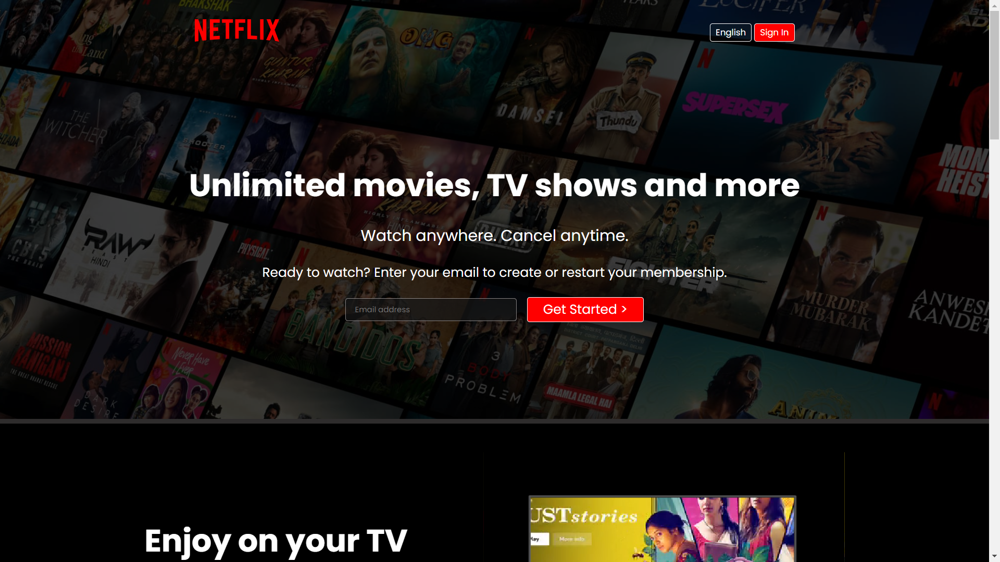

# Netflix Clone

This is a simple clone of the Netflix website homepage. It includes the following features:

- A hero section with a background image, logo, and text about Netflix
- Sections about how to enjoy Netflix on different devices
- A section about creating profiles for kids
- A FAQ section
- A footer with links to various Netflix pages

This is a basic clone and does not include any of the functionality of the real Netflix website.

## How to Use This Code

1. Save the HTML code as index.html.
2. Save the CSS code as style.css.
3. Create a folder called assets and place the following images inside it:
    - logo.svg
    - bg.jpg
4. Open index.html in a web browser.

## Screenshots

Here is a screenshot of the project:

## License

This code is provided for educational purposes only and is not licensed for commercial use.
